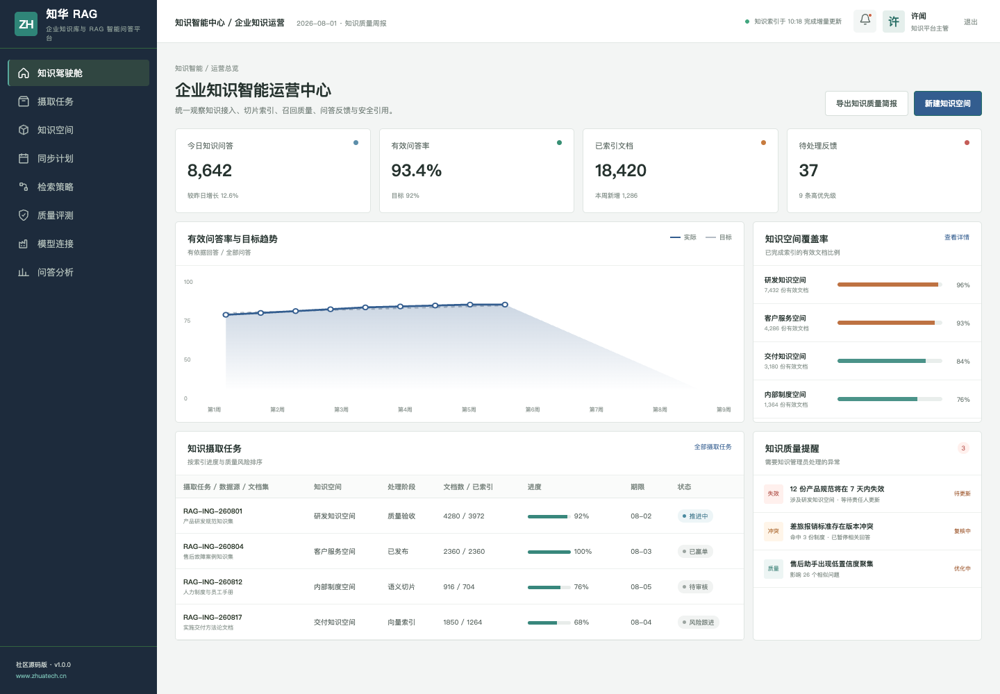
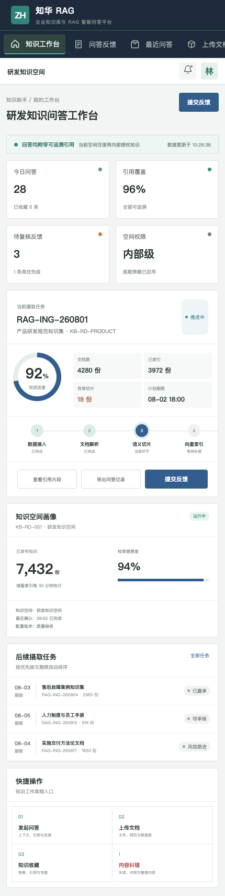

# ZhuaTech RAG｜知华科技企业知识库与 RAG 智能问答平台

> 面向企业内部知识检索、可信问答和知识治理的社区源码版，由知华科技（上海如静知华信息科技有限公司）发布。

[知华科技官网](https://www.zhuatech.cn/) · [部署指南](deploy/README.md) · [接口文档](docs/api.md) · [许可说明](LICENSE)

## 为什么需要可治理的企业 RAG

通用大模型并不了解企业内部规范、产品资料和业务数据。ZhuaTech RAG 将数据连接、文档解析、语义切片、向量索引、混合检索、重排、引用回答和质量评测纳入同一条可审计链路，回答必须展示来源，敏感知识按空间权限隔离。



管理端用于观察知识覆盖、检索健康度、答案质量和内容失效风险；移动工作台面向知识运营人员和业务用户，支持问答、引用核验、收藏与纠错。



## 功能范围

- 文件、网页、数据库和业务系统知识接入
- OCR/解析、语义切片、元数据与向量索引
- 关键词与向量混合检索、结果重排和可信引用
- 多知识空间、角色权限、脱敏与敏感内容过滤
- 黄金问题集、离线评测、用户反馈和知识失效治理
- 可替换的模型与向量服务 Provider，不内置真实密钥

```text
知识源 → 解析清洗 → 语义切片 → 混合检索 → 重排 → 引用回答 → 质量反馈
```

新增的检索质量评估接口会计算引用覆盖率和相似度置信等级，并根据敏感问题、低引用覆盖或低相似度给出继续检索、人工复核或直接回答建议，避免低依据内容直接进入生成环节。

## 工程与运行

后端采用 Java 21、Spring Boot、Spring Security、JWT、JPA 与 Flyway；前端采用 Vue 3、Pinia、Vue Router、Axios 和 Vite；生产数据库为 MySQL 8，测试使用 H2。工程包名 `cn.zhuatech.rag`，默认数据库 `zhuatech_rag`。

```bash
cd frontend
npm install
npm run dev:demo
```

访问 `http://localhost:5173`，管理端账号 `planner / Demo@2026`，知识运营端账号 `operator / Demo@2026`。全栈可执行 `cp .env.example .env && docker compose up --build`。演示数据均为虚构数据。

## 使用许可与商业授权

本工程仅限个人学习、研究和非商业技术交流，**不得用于商业用途**。企业内部使用、生产部署、SaaS 服务、项目交付、收费培训、品牌替换或商业再分发，须事先取得上海如静知华信息科技有限公司书面授权，具体以 [LICENSE](LICENSE) 为准。

企业知识库、RAG 问答、私有模型接入、数据治理和深度定制，请访问[知华科技官网](https://www.zhuatech.cn/)或扫码咨询：

| 微信咨询一 | 微信咨询二 |
| --- | --- |
|  |  |

SEO 关键词：企业 RAG、RAG 系统源码、企业知识库、知识库问答、向量检索、Java RAG、Vue AI 知识库、知华科技。
